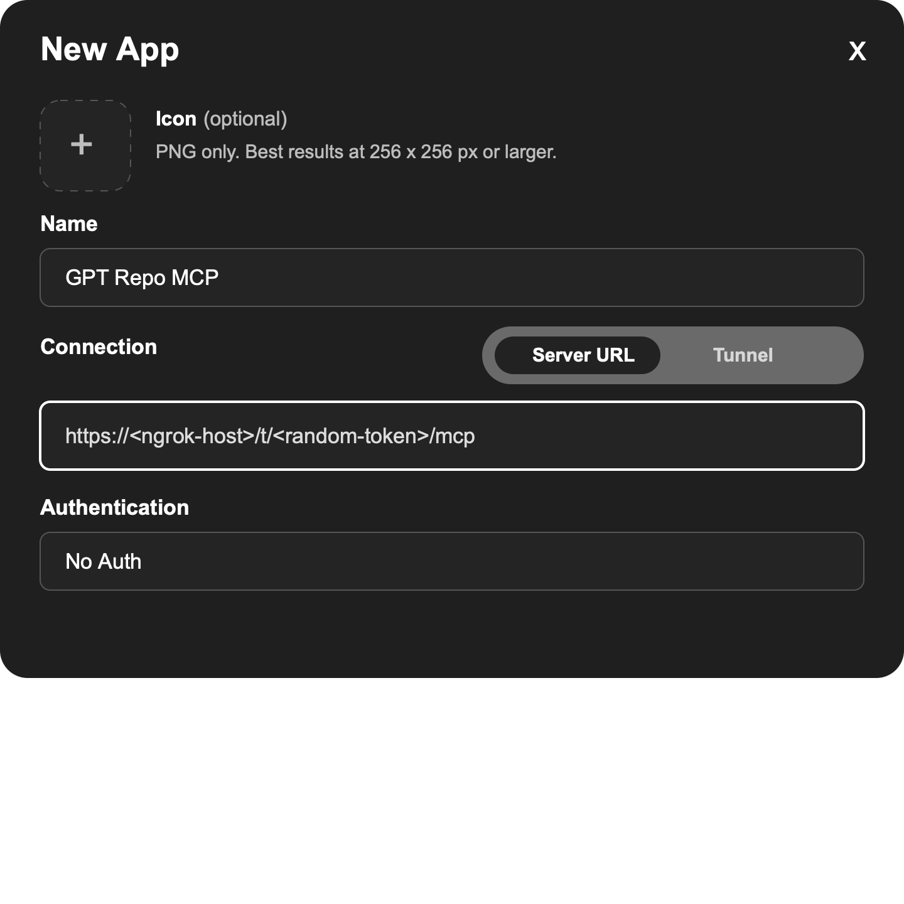
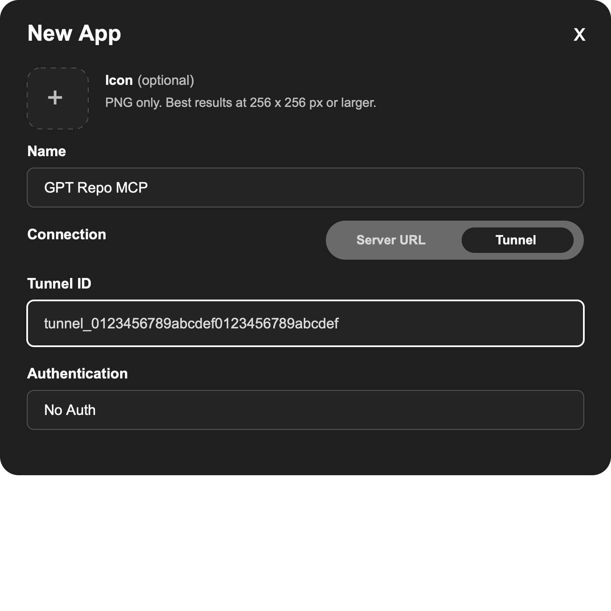

# Connect ChatGPT

Use this guide after completing [SETUP.md](SETUP.md). For tunnel provider details, see [CONNECTION_OPTIONS.md](CONNECTION_OPTIONS.md).

## Start The Server

Primary quickstart:

```bash
npm run connect
```

This starts the local MCP server and starts or reuses ngrok as the built-in convenience HTTPS tunnel. Copy the exact printed URL:

```text
ChatGPT MCP URL: https://<ngrok-host>/t/<random-token>/mcp
```

ChatGPT cannot call `localhost` directly. The built-in convenience path uses a public HTTPS `/t/<random-token>/mcp` endpoint.

The random path token is guess-resistance only, not authentication. Anyone with the full URL can reach the endpoint while the public tunnel is running. Treat public tunnel URLs as temporary local development endpoints and stop them between sessions.

Advanced secure tunnel:

```bash
npm run connect:secure
```

This starts the local MCP server and OpenAI Secure MCP Tunnel. Use it for longer-lived or private connector setups when your ChatGPT workspace supports MCP tunnels. See [CONNECTION_OPTIONS.md](CONNECTION_OPTIONS.md) for setup details.

## Add The Connector In ChatGPT

In ChatGPT:

1. Open Settings.
2. Open Apps & Connectors.
3. Open Advanced settings.
4. Enable Developer Mode.
5. Create a new app or connector.
6. For `npm run connect`, set Connector URL to the exact public `/t/<random-token>/mcp` endpoint printed by the command. For Secure MCP Tunnel, choose Tunnel as the connection type and select or paste the `tunnel_...` id.
7. Create the connector.
8. Verify the tool list appears.

After changing tool schemas, descriptions, or server instructions, refresh the connector metadata in ChatGPT.

## Server URL Or Tunnel

ChatGPT supports two connection fields for custom MCP apps. Use the one that matches how you started GPT Repo MCP.

### Server URL

Use **Server URL** for the built-in ngrok flow:

```bash
npm run connect
```

Paste the exact printed URL into the **Server URL** field:

```text
https://<ngrok-host>/t/<random-token>/mcp
```



### Tunnel

Use **Tunnel** for OpenAI Secure MCP Tunnel:

```bash
npm run connect:secure
```

Paste or select the printed `tunnel_...` id in the **Tunnel ID** field.



Do not paste an ngrok URL into the Tunnel field, and do not paste a `tunnel_...` id into the Server URL field.

## First Chat

Start a new chat, select the connector from the composer or tool menu, and ask:

```text
Use GPT Repo MCP. Which repositories can you access?
```

Then ask:

```text
Use GPT Repo MCP. Give me a project brief for <repo_id>.
```

Replace `<repo_id>` with one of the repository ids returned by the first prompt.

## Mutating Tool Confirmation

The default setup is read-mostly. `repo_write_file`, safe git operations, and cleanup tools are disabled by default unless repo-local config opts in.

When mutating tools are enabled, ChatGPT requires confirmation for write, git, or cleanup actions unless you choose to remember approval for the conversation.

## Connection Options

- Built-in convenience tunnel: run `npm run connect` and paste the printed `/t/<random-token>/mcp` URL.
- Manual tunnel provider: start the local server with an explicit token, expose port `8787` through your HTTPS tunnel or reverse proxy, and use `/t/<that-token>/mcp`.
- Advanced secure tunnel: run `npm run connect:secure` and choose Tunnel as the connector connection type.

See [CONNECTION_OPTIONS.md](CONNECTION_OPTIONS.md) for provider setup, token details, and troubleshooting.

## Troubleshooting

- The connector cannot connect through Secure MCP Tunnel: confirm `npm run connect:secure` is still running and the connector uses Tunnel.
- The connector cannot connect through a public tunnel: confirm the local server and tunnel are still running.
- The URL is rejected: confirm it starts with `https://` and, for public tunnel paths, exactly matches the current `/t/<token>/mcp` URL.
- Tools look stale: refresh connector metadata after code or description changes.
- No repositories are listed: run `npm run list`.
- Config looks wrong: run `npm run check:config` or `npm run doctor`.
